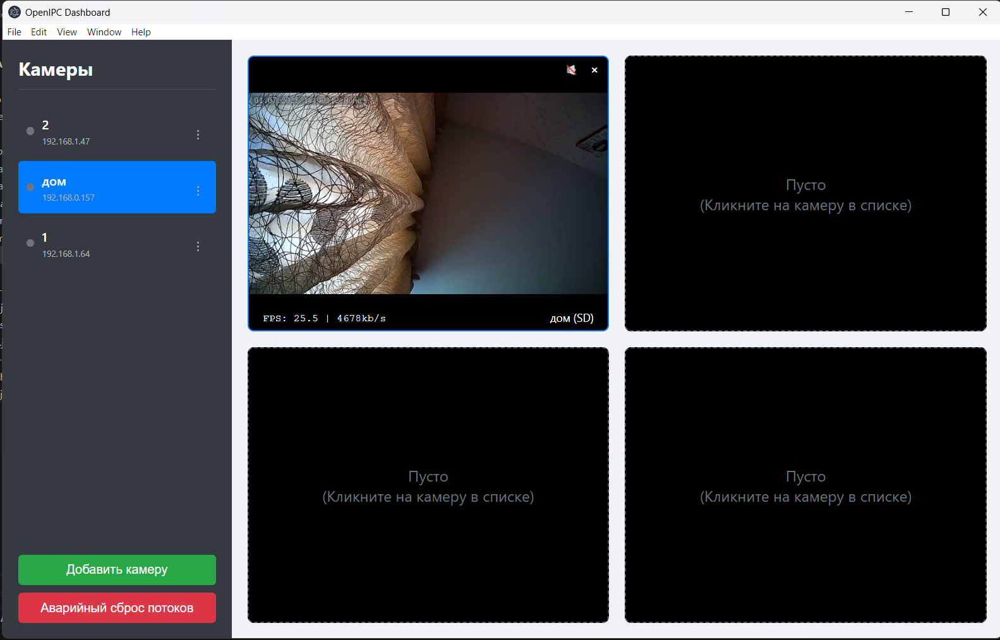

# OpenIPC Dashboard

 
<!-- Замените URL на прямую ссылку на ваш скриншот, когда загрузите его в репозиторий -->

**OpenIPC Dashboard** — это кросс-платформенное настольное приложение для удобного управления и мониторинга камер на базе прошивки OpenIPC.

Приложение создано с использованием Electron и предоставляет единый интерфейс для просмотра видеопотоков, администрирования настроек, работы с файловой системой и прямого доступа к командной строке камеры.

---

## 🚀 Основные возможности

*   **Мульти-просмотр:** Просматривайте до 4-х видеопотоков одновременно в настраиваемой сетке.
*   **Двойной поток:** Мгновенное переключение между основным (HD) и дополнительным (SD) потоком по двойному клику.
*   **Полноэкранный режим:** Детализированный просмотр одной камеры на весь экран.
*   **Встроенный SSH-клиент:** Полноценный терминал для прямого доступа к командной строке камеры без необходимости в сторонних программах.
*   **Файловый менеджер (SCP):** Удобный двухпанельный менеджер для загрузки прошивок, скачивания записей и управления файлами на камере.
*   **Редактор настроек:** Графический интерфейс для изменения всех параметров прошивки Majestic (`majestic.yaml`) с группировкой по вкладкам.
*   **Мониторинг:** Отображение статуса (online/offline) и температуры SoC камеры в реальном времени.
*   **Кросс-платформенность:** Работает на Windows, macOS и Linux.

## 📥 Установка

Готовые установочные файлы для последней версии можно найти на странице **[Releases](https://github.com/Rinibr/openipc-dashboard/releases)**.

<!-- Замените 'Rinibr/openipc-dashboard' на свой путь, если он отличается -->

#### Windows
1.  Скачайте файл `OpenIPC-Dashboard-Setup-x.x.x.exe`.
2.  Запустите установщик и следуйте инструкциям.

#### macOS
1.  Скачайте файл `OpenIPC-Dashboard-x.x.x.dmg`.
2.  Откройте `.dmg` файл и перетащите `OpenIPC Dashboard.app` в папку "Программы" (Applications).

#### Linux
1.  Скачайте файл `OpenIPC-Dashboard-x.x.x.AppImage`.
2.  Сделайте файл исполняемым:
    ```bash
    chmod +x OpenIPC-Dashboard-x.x.x.AppImage
    ```
3.  Запустите приложение:
    ```bash
    ./OpenIPC-Dashboard-x.x.x.AppImage
    ```

---

## 🛠️ Для разработчиков

### Стек технологий
*   [Electron](https://www.electronjs.org/)
*   [Node.js](https://nodejs.org/)
*   HTML, CSS, JavaScript (Vanilla JS)
*   [JSMpeg](https://jsmpeg.com/) для декодирования видео
*   [ssh2](https://github.com/mscdex/ssh2) для SSH и SCP
*   [electron-builder](https://www.electron.build/) для сборки

### Запуск в режиме разработки

1.  Клонируйте репозиторий:
    ```bash
    git clone https://github.com/Rinibr/openipc-dashboard.git
    cd openipc-dashboard
    ```

2.  Установите зависимости:
    ```bash
    npm install
    ```

3.  Запустите приложение:
    ```bash
    npm start
    ```

### Сборка приложения

Для сборки установочных файлов для вашей текущей платформы выполните команду:

```bash
npm run dist
```

Готовые файлы появятся в папке dist
